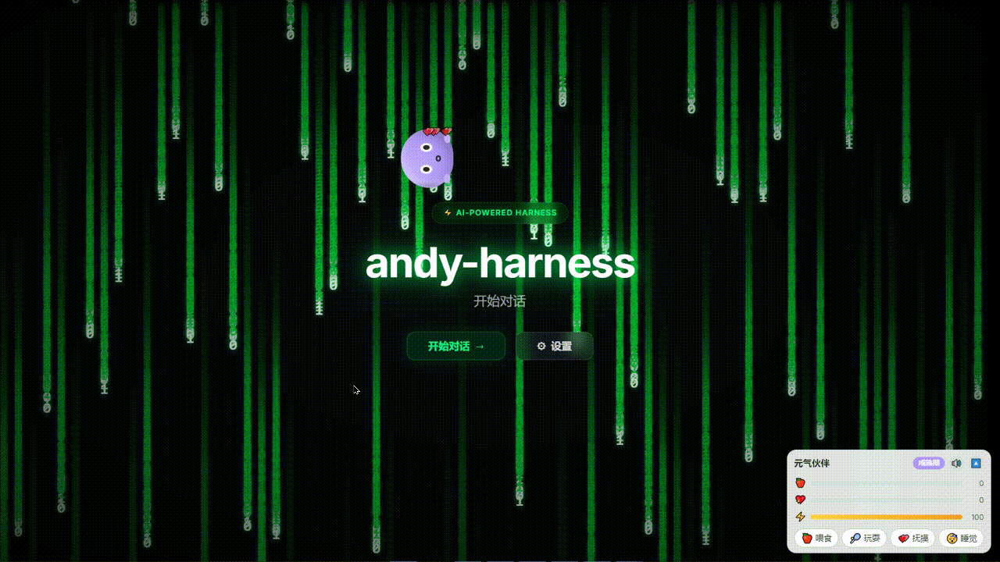

# andy-harness

> 插件化 Agent Harness（智能体底座）开源项目：提供对话 GUI、多模型接入（DeepSeek / Qwen / Doubao / 自定义）、会话文件传输（文档/图片多模态）、会话管理与分支、上下文管理、MCP 客户端（stdio / SSE 接入远程工具）、定时任务、长期记忆、子代理委派、运行轨迹 Tracing、Skills 技能系统、技能市场（SKILL.md 一键安装）、工具权限与人工确认、任务清单，以及沙箱与系统设置；并提供 **Computer Use 桌面操控**（截图 / 鼠标 / 键盘 / 命令执行等通用原语，安全围栏 + 截图降本策略，依赖可选 `desktop` extra）与 **MCP 市场**（libgen / deepwiki / context7 等免鉴权公开服务一键接入）；还提供 **桌面壳（Tauri）**（一个原生窗口内跑齐前后端、双击即用，退出自动回收后端进程树）、**多 Agent 编排**（并行任务 / 角色流水线）、**多渠道接入**（Webhook / Telegram）、**会话与消息搜索**、**Docker 沙箱**、**向量记忆检索**、**Checkpoint 断点续跑**、**Eval 回归评测**、**插件 / 技能外部分发安装（zip / git）** 与**可选认证 / 多用户**；1.0.x 已增量落地 **工作流编排（Workflow Studio，Dify 风格可视化画布）**、**模板分享中心（Template Hub）**、**洞察看板（Insights Dashboard）**、**评测实验室（Eval Lab）**、**插件开发者工作台（DevKit）**、**集成中心（飞书 api / cli / channel 三模式）** 与**权限审计与审计日志**。所有功能以插件形式构建，模块间完全解耦，对齐 Claude Code / Codex / Cline / Goose 等主流 Agent 的最佳实践，面向开发者学习与二次开发。敬请下载使用！

[](https://github.com/andyqiuqiubo/andy-harness/actions/workflows/ci.yml)
[](https://opensource.org/licenses/MIT)
[](https://www.python.org/)
[](https://vuejs.org/)
[](https://fastapi.tiangolo.com/)

> ⚠️ **免责声明（务必阅读）**：本软件由 AI 驱动，运行会产生 **Token 消耗与相应费用**，并可通过工具与 **Computer Use 自动操控你的电脑**（存在误操作系统、数据被修改、凭据泄露等安全风险）。使用前请务必阅读 [免责声明 DISCLAIMER.md](DISCLAIMER.md)，充分了解其功能与安全风险，并遵守中国对 AI 使用者的相关规定。

---

## 项目状态

- **当前版本：v1.0.0（开发者预览版）** —— 首个对外版本号，完整变更见 [GitHub Releases](https://github.com/andyqiuqiubo/andy-harness/releases)；1.0.0 之后已增量落地**工作流编排 / 模板分享中心 / 洞察看板 / 评测实验室 / 插件开发者工作台 / 集成中心（飞书）/ 权限审计**等新能力（详见下方功能特性）。
- 上手请先读 [用户使用手册](docs/andy-harness-v1.0.0用户使用手册.md)（图文、含 16 张界面截图）。
- 本仓库由作者在 **Windows 10** 个人 PC 下创建与开发，**尚未在 macOS / Linux 等其他操作系统上验证**，跨平台运行存在未知风险。
- 目前仅对 **DeepSeek `deepseek-v4-flash`** 模型做了深度调试与联调；Qwen / Doubao 等其它模型尚未充分验证，实际使用时可能遇到预期外的问题。
- 部分能力后端已实现但**暂无界面入口**（渠道 / Computer Use / Jev / 断点续跑 / 用户管理），具体见手册第 10 节与下方功能特性中的标注。
- **质量门禁现状（2026-10-07 实测）**：后端 `ruff check` / `ruff format --check` / `mypy --strict`（125 个源文件）/ `pytest`（742 passed、2 skipped）全通过；前端 `eslint` / `vitest`（57 用例）/ `vue-tsc` / `vite build` 全通过。CI 两个 job 均为绿。另于 2026-10-06 完成全项目系统性验证（静态检查 + 单测 + 前端单测 + 构建 + 前后端契约校验 + 23 步端到端冒烟），修复严重 bug / 功能缺口 / 前后端联动共 **20 项**（含外部包安装 git/HTTP 拉取超时与事件循环阻塞这一致命缺陷），详见全项目系统性验证与修复总结（2026-10-06，本地留存不入库）。仍存的预览版限制（前端包体未分包、渠道 / Computer Use / Jev / 断点续跑 / 用户管理无 UI 入口、Docker 前端未配反向代理、仅 Windows + 仅 DeepSeek 联调）见下方[已知问题与注意事项](#已知问题与注意事项)。

---

## 功能特性

- **多模型接入**：DeepSeek（含思维链）、Qwen、Doubao，支持自定义 OpenAI 兼容模型
- **Jev 结构化决策**：集成 TypeSafe AI Jev 模型，支持 Choice（选择型）/ Score（评分型）/ Noul（是非型）三种原语，AI 可自动调用进行结构化判断（Jev 仅有插件 Key 配置入口，决策由模型自动触发，无独立调用界面）
- **Skills 技能系统**：对齐 Agent Skills 开放标准（SKILL.md），三级渐进式披露——目录常驻、命中才加载正文、脚本/参考文档按需读取，装很多也不撑爆上下文；设置页可查看与启停
- **技能市场**：内置技能市场，一键安装社区 / 官方 SKILL.md 技能包（含说明弹窗），卸载后可随时重装；与插件市场共用前端面板
- **工具权限与人工确认**：工具按 read / write / dangerous 分级，危险工具（如代码执行器）默认需你点「允许」才运行；支持四档全局策略与按工具单独放行/确认/拒绝
- **任务清单（Todo）**：AI 用 `todo_write` 拆解多步骤任务，聊天页顶部实时显示进度（已完成 / 总数）与每项状态，切换会话自动同步
- **会话导出 / 导入 / 分叉 fork**：鼠标悬浮会话点「⋮」（或右键）即可导出为 JSON（含消息与任务清单）随身携带、复制为新会话（分叉）、重命名、归档、删除；页头「导入」可从导出的 JSON 恢复为新会话，也可从任意历史消息「复制为新会话」试错。
- **MCP 客户端**：通过 Model Context Protocol 接入外部工具生态（数据库、浏览器、SaaS 等）。支持两种传输——**本地进程 (stdio)** 与 **远程服务 (SSE/HTTP)**；配置 `mcp.json`（或 `MCP_CONFIG_PATH`）后自动连接并把远端工具注册给 AI 调用，设置页可查看连接状态、重连、增删 server（零第三方依赖）
- **MCP 市场**：内置 MCP 市场，一键接入 libgen / deepwiki / context7 / cloudflare-docs / gitmcp 等**免鉴权公开 MCP 服务**，立即获得文档检索 / 代码库问答 / 百科等远程工具；与插件市场共用前端面板
- **问答对操作**：每条提问可「复制 / 删除本轮（物理删除）」；每条回答可「复制 / 追问 / 从此处分叉」——鼠标悬浮到消息上即可看到操作按钮
- **会话文件传输**：聊天输入区点「📎」即可上传**文档**（txt/md/csv/json/py/js 等 26 种）与**图片**（png/jpg/gif/webp/bmp）随消息发给模型——文档内联为文本、图片缩放后按 OpenAI 视觉规范以 base64 注入，`deepseek-v4-flash` 实测可读文档内容、识别图片颜色；单条消息文档≤5、图片≤4、总数≤8，文档≤200KB、图片≤1.5MB（自动缩放控 token）；删除会话连带清理附件
- **大输出自动落盘**：工具返回超大结果时自动落盘为「制品」，上下文只保留摘要与路径，避免撑爆 token 预算；模型可用 `read_artifact` 分页回读全文，设置页「制品」标签可查看/删除
- **长期记忆**：跨会话记住用户偏好与项目事实（全局/会话两种作用域），新会话自动带入相关记忆；AI 可用 `memory_save` / `memory_search` 工具读写，设置页「记忆」标签可手动增删改查。**并支持定时自主总结**：后台按间隔把新增问答压缩成长期记忆（可关闭/调整间隔，也可在设置页「立即总结」）
- **运行轨迹（Tracing）**：每次对话的完整 span 链（模型调用 + 工具调用的耗时、token 用量、输入输出摘要）落在「轨迹」标签页，可用泳道图一眼看出「哪里慢、哪里贵、哪里错」
- **子代理委派**：AI 可用 `task` 工具把一个自包含子任务交给「上下文干净」的子代理在独立会话中完成，只把结论摘要带回主对话，主上下文不被中间探索过程污染
- **定时任务**：按「每天固定时间 / 每周 / 固定间隔 / 一次性」自动执行提示词；每个任务可多选 **MCP 服务器、Skills、其他工具**（未勾选的一律不开放），在新建的隔离会话里运行并记录运行历史，设置页「定时任务」标签页可视化配置
- **插件化架构**：一切皆插件，内核零业务逻辑，工具/Provider/服务/UI 均可插件化
- **插件市场**：内置插件市场，一键安装与说明查看，卸载后可随时重装，系统插件不可删除
- **外部分发安装（zip / git）**：除内置市场外，插件与技能均支持从 **zip 归档（本地路径或 http(s) URL）** 或 **git 仓库** 安装第三方包（`POST /api/plugins/install-external`、`POST /api/skills/install-external`），打通生态分发；安装器对 zip 做路径穿越防御、自动剥除外层包裹目录，git / HTTP 拉取内置 120s 超时（`HARNESS_PKG_INSTALL_TIMEOUT` 可调），源不可达不再挂起请求
- **元气宠物**：全局悬浮的养成系宠物，自由走动、悬停卖萌、喂食玩耍，作为市场插件安装后立即可用
- **前后端插件联动**：UI 插件通过 backend_plugin_id 与后端插件联动，启用/停用实时同步
- **会话管理**：多轮对话持久化、自动生成标题、归档/删除；存在空会话时点击"新建"自动跳转并提示
- **Token 用量展示**：基于 DeepSeek 官方 usage API，每条 AI 回答下方显示「本次用量」（输入 / 缓存 / 未命中 / 输出 / 合计）
- **聊天滚动控制**：流式回复中上滑即停止自动滚动，固定「向下」按钮一键回到最新回复或下一条提问
- **工具调用可视化**：工具卡片完整展示工具名、参数与执行结果，历史会话回看同样完整
- **上下文管理**：滑动窗口 / 摘要压缩 / 消息钉住，token 预算可控
- **沙箱执行**：Python/Shell 代码执行，资源限制，进程树终止
- **Computer Use 桌面操控**：让 Agent 操控整个本机桌面——截图 / 鼠标点击移动 / 键盘输入 / 文件读写 / 命令执行 / wait / finish 全套通用 OS 级原语；模型「计划先行」再执行，并内置**截图降本策略**（避免每轮都带截图导致图像 token 重复计费）；危险操作（如命令执行）默认需人工授权。依赖 `pyautogui` / `mss`，通过 `uv sync --extra desktop` 安装后启用（**前端暂无桌面操控开关**，由后端插件启用后模型按需自动调用）
- **思维链展示**：DeepSeek reasoning_content 逐步展示，完成后折叠
- **Provider 状态管理**：密钥配置、连接测试、启用/停用状态联动，停用后模型和工具自动隔离
- **多主题系统**：黑客帝国 / 深海蓝 / 日落紫红 / 中性深灰 / 亮色，AI 也可切换主题
- **Matrix 数字雨**：首页 Canvas 0/1 瀑布雨，鼠标弯曲效果
- **Markdown 渲染**：代码高亮、表格、GFM，流式内容实时渲染
- **前端插件机制**：UI 插件可注入视图、菜单项、路由
- **国际化**：中文 / 英文
- **桌面壳（Tauri）**：把前后端打包进一个原生窗口，双击即用、不依赖浏览器；Rust 壳职责很薄——选端口、经 `desktop/launcher/launch-backend.py` 拉起与回收后端（退出时 `taskkill /F /T` 终止整棵进程树，不留 uvicorn），后端只监听 `127.0.0.1`，数据落到每用户目录（Windows `%APPDATA%/andy-harness`），对话逻辑 100% 复用既有后端；前端 `api/runtime.ts` 通过 `get_backend_url` 命令解析后端绝对地址（HTTP / WS 均接入）
- **多 Agent 编排**：在子代理委派之上提供 `parallel`（多独立子任务并发，信号量控并发上限、按输入顺序返回、单任务异常隔离）与 `pipeline`（多角色阶段串行接力，上一阶段产出经 `{input}` 传入下一阶段，失败即终止）；护栏最多 10 任务 / 8 阶段，子代理内禁用这两个工具防递归
- **多渠道接入（Channel）**：外部系统可绕过 Web UI 直接对话——`Webhook` 渠道由 HTTP POST 入站、终答同步返回（`X-Channel-Secret` + 用户名单）；`Telegram` 渠道用 Bot API `getUpdates` 长轮询收发（offset 自动推进、白名单、超长截断）；同一渠道用户多次消息复用同一会话（`channel_links` 表持久映射）。（**渠道的创建 / 管理 / 状态查看暂无界面入口，仅提供 REST API**，原「设置页可查看渠道状态」不实）
- **会话 / 消息搜索**：侧边栏搜索框（300ms 防抖）按**会话标题或消息内容**检索，返回最多 3 条命中片段并高亮上下文，点击直达会话；`%` / `_` 等通配符已转义，默认不搜归档会话
- **Docker 沙箱后端**：代码执行可选容器级隔离——每次执行一次性容器（`docker run --rm`）、默认 `--network none` 禁网、内存 / CPU 限制、镜像白名单，超时 `docker rm -f` 强制删除不泄漏；`HARNESS_SANDBOX_BACKEND=docker` 或插件配置启用，docker 不可用时明确报错而非崩溃
- **向量记忆检索**：长期记忆从「LIKE 子串」升级为**余弦语义检索**——默认零依赖离线 `HashingEmbedder`，配置 `HARNESS_EMBEDDING_MODEL` 后走 OpenAI 兼容 `/embeddings` 获得真正语义匹配；无命中或无嵌入器时自动回退 LIKE，旧数据检索时懒回填向量
- **结构化上下文压缩（compaction v2）**：保留最近 N 条消息原文，更早的消息折叠为一条**结构化事件日志**（请求 / 工具调用含参数 / 结果 / 结论逐条编号），确定性折叠不依赖 LLM 重写（零额外成本、不产生幻觉），且裁剪边界不切断 `assistant(tool_calls) ↔ tool` 消息组
- **Checkpoint 断点续跑**：AgentLoop 在运行开始 / 每轮迭代后 / 终答 / 异常四处 best-effort 写入 `agent_runs` 检查点，`POST /api/runs/{run_id}/resume` 可基于已持久化上下文让模型继续（会话历史即完整状态快照，不重放内存态）（**断点续跑暂无界面按钮，需调用 REST API 触发**）
- **Eval 回归框架**：任务级客观评测——按「答案关键词 + 期望工具 + 禁用工具 + 迭代 / 耗时上限 + 无错误」逐项打分，聚合通过率、耗时、工具使用分布，`python -m harness.eval --cases <file>` 可导出 JSON / Markdown 报告，失败退出码 1 可直接做 CI 门槛
- **可选认证与多用户**：默认本地单用户、**行为零变化**；`HARNESS_AUTH=1` 后 `/api/**` 强制 Bearer token（PBKDF2 口令哈希 + HMAC 签名，默认 12h），会话与长期记忆按 `user_id` 隔离，WS 支持 `?token=`（无效关闭 1008），前端自动出现登录页并在 401 时回到登录页；开启认证后，插件 / 技能 / MCP 的安装卸载、权限与设置写入等**状态变更类端点需管理员身份**（`require_admin` 服务端校验），普通用户仅可调只读接口（**多用户仅提供登录门，用户 / 权限的创建与管理暂无界面入口，仅 REST API**）
- **工作流编排（Workflow Studio）**：Dify 风格可视化画布——开始 / 结束 / LLM / 代码 / 条件分支（多条件 AND/OR）/ HTTP 请求 / 模板转换 / 变量赋值八类节点，拖拽连线、平移缩放画布、整流运行并在运行面板逐节点回看结果；LLM / HTTP 节点对齐 Dify 能力（温度等参数 / 重试间隔 / 超时 / SSL 校验 / 推理输出分离），旧结构图加载时自动迁移；入口 `/workflows`
- **模板分享中心（Template Hub）**：提示词 / 技能 / 工作流 / 会话包等模板集中管理与一键导入使用，入口 `/templates`
- **评测实验室（Eval Lab）**：模型 × 提示词 A/B 对比评测的图形界面，任务级客观打分（关键词 / 期望工具 / 禁用工具 / 迭代与耗时上限），入口 `/evals`；配套 `python -m harness.eval` CLI 可直接当 CI 门槛
- **洞察看板（Insights Dashboard）**：会话 / 消息 / Token / 工具调用等内置指标 + 插件自定义指标聚合展示，入口 `/insights`
- **插件开发者工作台（DevKit）**：面向二次开发者的插件脚手架与开发辅助工具，入口 `/devkit`
- **集成中心（Integration Hub）**：飞书三模式接入——`api`（app_id/app_secret 直调开放接口）/ `cli`（lark-cli 子进程）/ `channel`（WebSocket 长连，群里 @机器人即答，可选 `feishu` extra：`lark-oapi>=1.7.0`）；出网代理经 `backend/.env.local` 注入（已 git-ignore，启动脚本与后端统一读取）
- **权限审计与审计日志**：管理员校验（`require_admin`）之上记录状态变更审计事件，设置页「审计日志」标签可查询操作流水

---

## 演示



> 演示 MCP 客户端（接入远程服务并调用工具）、设置页各标签（MCP / 输出制品 / 记忆 / 轨迹 / 定时任务 / Skills / 权限）、插件管理、会话导出/导入/分叉等特性（GIF）。

---

## 快速开始

> [!TIP]
> **二次开发者 · 最快跑通路径（Windows 实测）**：把 <https://github.com/andyqiuqiubo/andy-harness> 下载（`git clone` 或 Download ZIP）并部署到你的本地项目目录 → 装依赖（`cd backend && uv sync --extra dev`；`cd frontend && pnpm install`）→ 构建前端产物（`cd frontend && pnpm build`）→ 双击 **`start-all.bat`** 自动拉起前后端并打开浏览器 <http://localhost:5173>，即可正确运行。首次安装约 16 分钟 / 磁盘约 2.1 GB；逐条命令、耗时基线、磁盘隔离与 14 条踩坑速查见下方「🧪 实测运行指南」章节。

### 环境要求

- Python 3.11+
- Node.js 22.12+（或 20.19+；Vite 8 的 engines 要求 `^20.19.0 || >=22.12.0`，Node 22.0~22.11 不满足，实测 Node 24 正常）
- pnpm 10+
- uv（Python 包管理器）
- **Rust 工具链（仅桌面壳需要）**：用 [rustup](https://rustup.rs/) 安装稳定版（`rustc` ≥ 1.77.2）；只跑浏览器模式（`start-all.bat` / `make backend` + `make frontend`）可跳过
- **GNU Make**（Windows 上 Git for Windows 不自带 `make`；缺了它 `make install/backend/frontend` 会报 `command not found`。Windows 可用 Chocolatey `choco install make`，或改用下面的「不使用 make」方式）

### 安装

```bash
# 克隆仓库（仓库含 gif/ videos/ 演示资源约 47 MB，浅克隆更快；想保留完整历史去掉 --depth 1）
git clone --depth 1 https://github.com/andyqiuqiubo/andy-harness.git
cd andy-harness

# 安装前后端依赖（Windows 主路径，无需 make）
cd backend && uv sync --extra dev     # 生成 backend\.venv；首次实测约 16 分钟 / 54 个包
cd frontend && pnpm install           # 生成 frontend\node_modules；实测约 2 分钟 / 253 个包

# 构建一次前端产物（后端 pytest 与桌面壳都依赖 frontend/dist）
cd frontend && pnpm build
```

> 已装 GNU Make 的环境（Linux / macOS，或 Windows 上 `choco install make`）也可用 `make install` 一键完成前两步；`make backend` / `make frontend` 分别等价于启动后端 / 前端。Windows 不自带 make，实测建议直接用上面的等价命令（详见 FAQ 第 2 条）。

> 若要启用 **Computer Use 桌面操控**，后端需额外安装桌面依赖：`cd backend && uv sync --extra dev --extra desktop`（或在已装好的 venv 中再执行 `uv sync --extra desktop`）。未安装时 Computer Use 工具会优雅降级为「桌面不可用：未安装 pyautogui/mss」。

> Windows 下若不想装 `make`，可先按上面两条命令装好依赖，再双击 `start-all.bat` 一键拉起前后端（`start-all.bat` 不会自动安装依赖，它只会复用已存在的 `backend/.venv` 与 `frontend/node_modules`）。想要**一个窗口的桌面应用**，装好 Rust 后双击 `start-desktop.bat`（详见下方「桌面壳（Tauri）启动」）。

### 配置 API Key

通过环境变量配置 DeepSeek API Key：

```
DEEPSEEK_API_KEY=sk-your-api-key-here
```

> 也可以启动后在设置页面配置：http://localhost:5173/settings → Providers → 编辑 DeepSeek → 填入 API Key

### 启动开发服务器

**方式 A（Windows 推荐）**：双击根目录 **`start-all.bat`** —— 自动拉起前后端（两个窗口）并自动打开浏览器；停止双击 `stop-all.bat`。注意它**不会自动安装依赖**，只复用已有的 `backend/.venv` 与 `frontend/node_modules`。

**方式 B（两个终端 / 跨平台）**：

```bash
# 终端 1：启动后端（端口 8000）
make backend     # 或：cd backend && uv run uvicorn harness.main:app --reload --host 127.0.0.1 --port 8000

# 终端 2：启动前端（端口 5173）
make frontend    # 或：cd frontend && pnpm dev
```

访问：
- 前端：http://localhost:5173
- 后端健康检查：http://localhost:8000/api/health
- API 文档：http://localhost:8000/docs

### 桌面壳（Tauri）启动

把前端与后端装进**一个原生窗口**，双击即用、不依赖浏览器。Windows 下可直接双击 **`start-desktop.bat`**（会检查依赖与 Rust、检测端口占用，缺 Rust 时给出 rustup 安装指引），停止用 **`stop-desktop.bat`**；下面是等价的手动命令。

```bash
# 0. 一次性：安装 Rust 工具链（https://rustup.rs/，装完重开终端）
#    Windows 10/11 一般自带 WebView2，缺失时打包会引导下载

# 1. 安装依赖（仓库不含 node_modules）
cd backend && uv sync --extra dev
cd frontend && pnpm install
cd desktop && pnpm install          # 安装 Tauri CLI

# 2. 开发运行：一条命令起齐 Vite(:5173) + Rust 壳 + 后端（动态端口）
cd desktop && pnpm dev

# 3. 打包安装包（Windows 为 MSI / NSIS）
cd desktop && pnpm build            # 产物在 desktop/src-tauri/target/release/bundle/
```

- **启动链路**：`tauri dev` 先执行 `beforeDevCommand`（`pnpm --dir ../frontend dev`）拉起 Vite(:5173)，再编译并打开 Tauri 窗口，由 Rust 壳调用 `desktop/launcher/launch-backend.py` 拉起后端；前端通过 `get_backend_url` 命令拿到后端绝对地址（HTTP / WS 均适用，失败回退 `http://127.0.0.1:8000`）
- **更新代码后，窗口里的 exe 一定是新编的**：机制上无需任何手动操作——
  - `tauri dev` 每次启动都会先跑 `cargo build`，而 cargo 用**内容指纹**（不是时间戳）判断是否需要重编：`desktop/src-tauri/src/*.rs`、`Cargo.toml` / `Cargo.lock`、`tauri.conf.json`、`capabilities/` 任一内容变了就重编，没变就是秒级 no-op；
  - **前端根本不进 dev 版 exe**：dev 模式窗口加载的是 Vite 的 `devUrl`，改前端由 HMR 即时生效，不需要重新编译；
  - 打包路径同理：`pnpm build` 会先跑 `beforeBuildCommand`（重建 `frontend/dist`）再 `cargo build --release`，装出来的包也永远对应当时的代码；
  - 想要**可见的证据**：`start-desktop.bat` 启动时会打印新鲜度判定（`FRESH` / `STALE` / `MISSING` + 具体时间与最「新」的源文件）以及当前运行的是哪个 exe、它的构建时间、git HEAD 与工作区是否干净；壳自己也会在 `andy-harness-desktop` 窗口打印后端基地址；
  - 兜底开关：`start-desktop.bat --clean`（删掉 `desktop/src-tauri/target` 从零重编，交互确认）、`start-desktop.bat --help`。
- **与浏览器模式的区别**：桌面壳后端只监听 `127.0.0.1`（不暴露局域网）且端口**动态分配**（可用 `HARNESS_PORT` 固定）；数据目录为每用户目录——Windows `%APPDATA%/andy-harness`、macOS `~/Library/Application Support/andy-harness`、Linux `~/.local/share/andy-harness`，与 `start-all.bat` 模式使用的 `backend/data/` 相互独立。**注意**：该切换目前只覆盖 `harness.db` 与 `attachments/`（经 `HARNESS_DB_PATH` / `HARNESS_ATTACHMENTS_DIR`），`auth_secret.txt`、`permission.json`、`skill_state.json`、`settings.json` 与制品目录（`backend/workspace/artifacts`）仍写在仓库的 `backend/data/` 下——从仓库目录运行时无差别，装机到只读目录时需留意（预览版已知限制，详见《发布前分析报告》P1-2）
- **停止**：关闭应用窗口或在该终端 `Ctrl+C`，壳会终止整棵后端进程树（含 uvicorn 与 MCP 子进程）；也可双击 `stop-desktop.bat`
- **常用环境变量**：`HARNESS_PORT`（固定后端端口）、`HARNESS_PYTHON`（指定后端解释器，默认仓库 `backend/.venv`，release 包默认从 PATH 找 `python`）、`HARNESS_AUTH=1`（开启登录鉴权）
- **启动前自检**：`backend\.venv\Scripts\python.exe desktop\launcher\launch-backend.py --check` 会打印 host / port / python / data_dir / db_path 与 `problems`（为空才可启动），是排查「壳起来后连不上后端」最快的入口
- **不要在桌面壳运行时同时执行 `start-all.bat`**：两者都要占用 5173；反之亦然

### Docker 部署

```bash
docker compose up -d     # Compose V2 插件（Docker Desktop / 新版 CLI，推荐）
docker-compose up -d     # Compose V1 旧独立命令
```

启动后访问 http://localhost:5173 。**安全说明**：`docker-compose.yml` 将端口绑定到 `127.0.0.1`（仅本机可访问，不暴露局域网）；后端镜像内置插件市场 / 技能市场 / MCP 市场的包（`backend/marketplace`、`backend/skills`、`backend/mcp_marketplace`），开箱即可从设置页一键安装。

> ⚠️ **已知限制（预览版）**：前端镜像目前用静态服务器 `serve -s dist` 托管，**未配置 `/api` 与 `/ws` 反向代理**，因此容器模式下浏览器能打开页面但连不上后端（接口返回 HTML 兜底、WebSocket 无法握手）。Docker 路径**尚未端到端验证**，当前请优先使用 `uv sync` + `pnpm install` + `start-all.bat` 这条已验证路径；如需容器化联调，请自行给前端加一层 nginx 反向代理（`location /api/ → backend:8000`、`location /ws/ → backend:8000` 并透传 `Upgrade` / `Connection` 头）。

---

## 🧪 实测运行指南（Windows 实机复现，含磁盘占用与踩坑速查）

> 本节所有数字都来自一次**全新克隆**的干净环境（环境见下表）。先看「实测基线」了解要花多少时间和磁盘，再照「完整流程」复制粘贴。

### 实测基线（2026-10-03，Windows 10）

| 项目 | 实测值 |
|---|---|
| 实测工具链 | Python **3.14.4** / uv **0.10.12** / Node **24.15.0** / pnpm **10.32.1** / Git 2.23.0 |
| 仓库体积 | GitHub 报告 **≈47 MB**（含 `gif/`、`videos/`，508 个文件） |
| `uv sync --extra dev` | **54 个包，耗时 16 分 00 秒**（网络一般时的主要耗时点） |
| `pnpm install` | **253 个包，耗时 1 分 51 秒** |
| 安装后磁盘占用 | 前端 `node_modules` **802.9 MB**；整个项目目录（含缓存）**约 2.1 GB** |
| 启动耗时 | 后端就绪 < 10 秒；前端 Vite 就绪约 1 秒 |
| 质量门禁 | `ruff check` ✅ / `ruff format --check` ✅（264 文件）/ `mypy --strict` ✅（**125 个源文件**）/ `eslint` ✅ / `vitest` ✅（**57 个用例**）/ `pnpm build` ✅ |
| `pytest` | **742 passed, 2 skipped**（⚠️ 必须先 `pnpm build`，否则多 1 个 failed，见踩坑 8） |
| 插件加载 | 启动日志：**34 个插件**已加载并激活 |

### 完整流程（Windows PowerShell，复制即可）

```powershell
# ── 0. 一次性前置检查（缺哪个装哪个，安装命令见本节末尾） ──
uv --version          # 需要 uv
node --version        # 需要 Node 22.12+ / 20.19+
pnpm --version        # 需要 pnpm 9+（CI 用 10）
git --version

# ── 1. 克隆（仓库含 gif/videos，用浅克隆更快） ──
git clone --depth 1 --single-branch https://github.com/andyqiuqiubo/andy-harness.git
cd andy-harness

# ── 2. 安装前后端依赖（仓库不含 .venv / node_modules，必须先装） ──
cd backend
uv sync --extra dev            # 生成 backend\.venv；首次较慢（实测 16 分钟）
cd ..\frontend
pnpm install                   # 生成 frontend\node_modules

# ── 3. 构建一次前端产物（重要！后端 pytest 与桌面壳都依赖 frontend\dist） ──
pnpm build                     # vue-tsc + vite build，实测约 3 秒

# ── 4. 启动（二选一） ──
cd ..                          # 回到仓库根目录
.\start-all.bat                # 方式 A：一键拉起前后端（两个窗口），并自动开浏览器
# 方式 B：分别启动（便于看日志）
#   cd backend  ; .\.venv\Scripts\python.exe -m uvicorn harness.main:app --reload --host 127.0.0.1 --port 8000
#   cd frontend ; pnpm dev
```

启动后访问（**注意用 `localhost`，不要用 `127.0.0.1`**，原因见踩坑 9）：

| 用途 | 地址 |
|---|---|
| 前端界面 | http://localhost:5173 |
| 后端健康检查 | http://localhost:8000/api/health → 期望 `{"status":"ok"}` |
| API 文档（Swagger） | http://localhost:8000/docs |

**30 秒自检（可选，确认真的跑起来了）**：

```powershell
Invoke-RestMethod http://127.0.0.1:8000/api/health           # {"status":"ok"}
(Invoke-RestMethod http://127.0.0.1:8000/api/plugins).Count  # 34
netstat -ano | findstr ":8000 :5173" | findstr LISTENING     # 两个端口都在监听
```

停止：双击 `stop-all.bat`（按「窗口标题 + 端口 8000/5173」双策略清理）。

### 想装到指定盘、不污染 C 盘？按下面做

本项目默认会把**下载缓存**放到 C 盘用户目录，即使仓库放在 D/E 盘也一样。若你希望「代码 + 依赖 + 缓存」全部留在项目目录（本次实测就是这么做的，C 盘零写入），**先设置环境变量再做任何安装**：

```powershell
# 一次性把缓存/临时目录重定向到项目目录（把 E:\projtects 换成你自己的项目目录）
$root = 'E:\projtects'
$env:UV_CACHE_DIR          = "$root\.env\uv-cache"    # uv 下载缓存（默认 %LOCALAPPDATA%\uv\cache）
$env:UV_PYTHON_INSTALL_DIR = "$root\.env\uv-python"   # uv 托管 Python（默认 %APPDATA%\uv\python）
$env:UV_TOOL_DIR           = "$root\.env\uv-tools"
$env:UV_TOOL_BIN_DIR       = "$root\.env\uv-bin"
$env:PIP_CACHE_DIR         = "$root\.env\pip-cache"
$env:npm_config_cache      = "$root\.env\npm-cache"   # npm 缓存
$env:npm_config_tmp        = "$root\.env\tmp"
$env:TMP = $env:TEMP       = "$root\.env\tmp"         # 临时目录（默认 %LOCALAPPDATA%\Temp）

cd backend     ; uv sync --extra dev
cd ..\frontend ; pnpm install --store-dir ..\.env\pnpm-store   # 关键：pnpm 内容仓库默认在 C 盘
pnpm store path                                                # 校验：应输出你指定的盘
```

| 内容 | 默认位置（C 盘） | 重定向开关 |
|---|---|---|
| uv 下载缓存 | `%LOCALAPPDATA%\uv\cache` | 环境变量 `UV_CACHE_DIR` |
| uv 托管 Python | `%APPDATA%\uv\python` | 环境变量 `UV_PYTHON_INSTALL_DIR` |
| pnpm 内容仓库 (store) | `%LOCALAPPDATA%\pnpm\store` | `pnpm install --store-dir <路径>` 或环境变量 `npm_config_store_dir` |
| npm 缓存 | `%APPDATA%\npm-cache` | 环境变量 `npm_config_cache` |
| 系统临时目录 | `%LOCALAPPDATA%\Temp` | 环境变量 `TMP` / `TEMP` |
| 后端虚拟环境 | `backend/.venv`（**已在项目内**） | 无需设置 |
| 前端依赖 | `frontend/node_modules`（**已在项目内**） | 无需设置 |
| 运行数据（SQLite / 附件 / 密钥） | `backend/data/`（**已在项目内**） | `HARNESS_DB_PATH` 等（桌面壳模式见桌面壳章节） |

> ⚠️ uv 的缓存重定向必须用**环境变量**：`uv sync` 没有 `--python-install-dir` 参数（实测报 `unexpected argument '--python-install-dir' found`）。

### 首次启动看到这些日志，**不是报错**

下面三行是「未配置 / 能力降级」提示，不影响正常对话（实测确认）：

```
Telegram 渠道已注册但未配置 HARNESS_TELEGRAM_BOT_TOKEN，未启动
Computer Use：真实桌面控制不可用（缺 pyautogui/mss 或无显示器）...文件/命令能力仍可用。
Jev Manager 已激活，但未配置 API Key。请在设置页面配置 jev_manager 的 api_key...
```

消除办法：Computer Use 执行 `uv sync --extra dev --extra desktop`；Jev 在「设置 → 插件管理 → Jev Manager」填 Key；Telegram 设置 `HARNESS_TELEGRAM_BOT_TOKEN`。

### 实测踩坑记录（现象 → 原因 → 解决）

| # | 现象 | 原因 | 解决 |
|---|---|---|---|
| 1 | `git clone` 卡很久甚至超时 | 仓库含 `gif/`、`videos/`，约 47 MB | 浅克隆：`git clone --depth 1 --single-branch ...` |
| 2 | `uv sync` 报 `unexpected argument '--python-install-dir' found` | 该名字是**环境变量**，不是 `uv sync` 的参数 | 用 `$env:UV_PYTHON_INSTALL_DIR = ...` |
| 3 | `uv sync` 第一次跑了 16 分钟 | 要下载 54 个包（numpy/matplotlib/mypy/ruff 各 10 MB 级） | 属正常；国内可加 `$env:UV_DEFAULT_INDEX='https://pypi.tuna.tsinghua.edu.cn/simple'` |
| 4 | C 盘悄悄涨了几百 MB | uv / pnpm / npm / 临时目录默认都落 C 盘用户目录 | 按上一节把缓存重定向到项目目录 |
| 5 | 想改用 `npm install` | 仓库用 `pnpm-lock.yaml` 锁版本，npm 会重新解析依赖 | 坚持用 pnpm 9+（CI 用 10） |
| 6 | `make install` 报 `command not found` | Windows / Git for Windows 不自带 `make` | 不装 make，直接用 `uv sync` + `pnpm install`；或 `choco install make` |
| 7 | `make clean` 报错 | Makefile 里用的是 `rm -rf`，Windows 无此命令 | 手动删 `backend\.venv`、`frontend\node_modules`、`frontend\dist` 等 |
| 8 | 干净克隆后 `pytest` 出现 **1 failed** | `test_desktop_shell.py::test_tauri_conf_is_valid_and_grounded` 断言 `frontend/dist` 存在，此时尚未构建前端 | 先 `cd frontend && pnpm build` 再跑 `pytest` → 实测变为 **742 passed, 2 skipped** |
| 9 | 浏览器打不开 `http://127.0.0.1:5173` | Vite 默认只绑 `localhost`，Windows 上解析为 IPv6 `[::1]` | 地址栏用 **`http://localhost:5173`**；或启动时显式 `pnpm exec vite --host 127.0.0.1` |
| 10 | 按「Node.js 22+」装了 Node 22.0 却起不来 | Vite 8 的真实要求是 `^20.19.0 \|\| >=22.12.0` | 用 Node **22.12+**（或 20.19+）；实测 Node 24 正常 |
| 11 | `start-all.bat` 一闪就退，提示「系统找不到指定的路径」 | 没先装依赖（仓库不含 `.venv` / `node_modules`） | 先执行安装步骤；`start-all.bat` **不会**自动装依赖，只复用已有环境 |
| 12 | 提示 `Port 8000 is already in use`（或 5173） | 有旧实例仍在运行 | 先双击 `stop-all.bat`，再启动 |
| 13 | 界面能打开但发消息失败 | 没配模型 API Key | 「设置 → Providers → 编辑 DeepSeek → 填 Key 并启用」；仅内置 DeepSeek 支持环境变量 `DEEPSEEK_API_KEY` |
| 14 | 桌面壳模式看不到浏览器模式的历史会话 | 两者数据目录不同（桌面壳 `%APPDATA%\andy-harness`，浏览器模式 `backend/data/`） | 属设计如此，详见「桌面壳（Tauri）启动」章节 |

### 前置工具怎么装

```powershell
# uv（Python 包管理器）——任选一种
winget install --id=astral-sh.uv -e
# 或：powershell -ExecutionPolicy ByPass -c "irm https://astral.sh/uv/install.ps1 | iex"
# 或：pip install uv

# Node.js（建议 22.12+ 或 24 LTS）：winget install OpenJS.NodeJS.LTS
# pnpm：npm i -g pnpm      （或 corepack enable ; corepack prepare pnpm@10 --activate）

# 校验
uv --version ; node --version ; pnpm --version
```

---

## ⚠️ 下载后常见问题（排错）

> 下面是「照着 README 走却仍然踩坑」的高频问题，建议先读一遍再动手。

### 1. 没装依赖就启动 → 报「系统找不到指定的路径」/ 模块缺失
仓库**不包含** `backend/.venv` 和 `frontend/node_modules`（都被 `.gitignore` 排除）。无论用 `make install` 还是双击 `start-all.bat`，都必须先装依赖：

```bash
cd backend && uv sync --extra dev      # 生成 .venv 并安装后端依赖
cd frontend && pnpm install            # 生成 node_modules
```

直接双击 `start-all.bat` 而没装依赖，Windows 会弹出一个黑色窗口并瞬间报「系统找不到指定的路径」——这不是代码 bug，就是依赖没装。

另外，**文档 / 图片上传依赖 `python-multipart`**——缺失时上传接口会失败；`start-all.bat` 启动时会专门检测 `import multipart` 并给出修复提示，正常执行 `uv sync --extra dev` 会自动装上。

### 2. Windows 上 `make install` 报 `command not found: make`
Git for Windows 自带的 bash **不带 make**。两种解法：

- 安装 make：Chocolatey 执行 `choco install make`（或用 MinGW 的 `mingw-get install make`）；
- 不装 make，直接用上面第 1 条的等价命令（见「快速开始 → 安装」）。

### 3. 必须用 pnpm，不要 `npm install`
仓库用 `pnpm-lock.yaml` 锁定依赖版本。用 `npm install` 会重新解析依赖，可能与锁文件不一致甚至失败。请先安装 pnpm 10+：

```bash
npm i -g pnpm
```

之后用 `pnpm install`。国内网络可加镜像加速：`pnpm install --registry=https://registry.npmmirror.com`。

### 4. 前端打不开？只能用 `http://localhost:5173`
Vite 默认把开发服务器绑定到 `localhost`（解析为 IPv6 `[::1]`）。直接访问 `http://127.0.0.1:5173` 会**连不上**。浏览器地址栏请使用 **`http://localhost:5173`**。`start-all.bat` 末尾自动打开的也是这个地址。

### 5. 能启动但没法对话？需要先配 Provider 的 API Key
不配 Key 也能启动（后端日志只会有 `Jev Manager 已激活，但未配置 API Key` 的警告），但发消息会失败。配置方式二选一：

- 启动后在页面设置：http://localhost:5173/settings → Providers → 编辑对应 Provider → 填入 Key 并启用；
- 或通过环境变量配置：**仅内置 DeepSeek 插件**支持环境变量回退 `DEEPSEEK_API_KEY`；Qwen / Doubao 目前只从「设置页 → Providers」的插件配置读取 Key（或在自定义 Provider 里配置任意 OpenAI 兼容端点的 Key）。

> **Jev 结构化决策**需要**单独的** `jev_manager` API Key（设置 → 插件管理 → Jev Manager），与 Provider Key 不是同一个。未配置时调用 Jev 工具只会返回友好错误提示，不影响普通对话。

### 6. 端口被占用（8000 / 5173）
若目标端口已被占用，`start-all.bat` 会提示 `Port 8000 is already in use` / `Port 5173 is already in use` 并退出。先双击 `stop-all.bat` 关闭旧实例，或手动结束占用进程后再启动。

### 7. Python 用哪个版本？
后端要求 Python 3.11+。`uv sync` 会自动下载并管理合适的 Python（无需你手动安装），只要本机有可用的 3.11+ 或允许 uv 联网下载即可。

### 8. 国内网络下载慢 / 超时
- **Python 依赖**：`uv sync` 可指定国内镜像提速：

  ```bash
  UV_DEFAULT_INDEX=https://pypi.tuna.tsinghua.edu.cn/simple uv sync --extra dev
  ```

- **前端依赖**：用 npmmirror 镜像 `pnpm install --registry=https://registry.npmmirror.com`。

### 9. Computer Use 桌面操控提示「桌面不可用」

后端只装了基础依赖（`uv sync --extra dev`）时，`pyautogui` / `mss` 未安装，`RealDesktopController.available` 为 `False`，Computer Use 工具会返回「桌面不可用：未安装 pyautogui/mss」。解决：

```bash
cd backend && uv sync --extra dev --extra desktop
```

或在已装好的 venv 中再执行 `uv sync --extra desktop`，重启后端即可。

### 10. 桌面壳启动报 `cargo` / `rustc` 不是内部或外部命令，或报 MSVC 工具集缺失

桌面壳会把一小段 Rust 程序编译成窗口进程，因此**桌面模式需要两套东西**（浏览器模式都不需要）：

1. **Rust 工具链**：从 https://rustup.rs/ 下载并运行 `rustup-init`（稳定工具链，项目要求 `rustc` ≥ 1.77.2）；
2. **MSVC C++ 工具集 + Windows SDK**（**光装 rustup 编不过**）：下载 https://aka.ms/vs/17/release/vs_buildtools.exe 后静默执行：

   ```bat
   vs_buildtools.exe --quiet --wait --norestart --add Microsoft.VisualStudio.Workload.VCTools --includeRecommended
   ```
3. **重开终端**（刷新 PATH）后重新双击 `start-desktop.bat`（或 `cd desktop && pnpm dev`）。

`start-desktop.bat` 会依次探测：`where cargo` / `where rustc` → 用 `vswhere -requires Microsoft.VisualStudio.Component.VC.Tools.x86.x64` 检查 MSVC 工具集（能识别装在非默认盘的实例，例如 `F:\VSBuildTools`），任一缺失都直接打印对应安装指引并退出，不会抛一堆看不懂的编译错误。

> 资料：Rust MSVC 目标用的是 MSVC 的 `link.exe`，链接 Windows API（`kernel32.lib` 等）与 UCRT 时必须有 Windows SDK，所以 Tauri 官方前置条件把「Desktop development with C++」列为必需。想省 C 盘空间，可用 `--installPath F:\VSBuildTools --cache F:\VSCache` 配合 `HKLM\SOFTWARE\Policies\Microsoft\VisualStudio\Setup` 的 `CachePath` / `SharedInstallationPath` 策略把下载与安装都指向其它盘。

### 11. 桌面壳和 `start-all.bat` 不要同时跑；桌面壳怎么停

- 两者都要占用前端端口 **5173**：`start-all.bat` 固定 `8000 + 5173`，桌面壳用 `5173 + 动态后端端口`。启动前先关掉另一个（`stop-all.bat` / 关闭桌面窗口）。
- 桌面壳的后端端口是**动态分配**的，`stop-all.bat` 按 8000 / 5173 清理**抓不到**它。请用「关闭应用窗口 / 在该终端 `Ctrl+C` / 双击 `stop-desktop.bat`」停止——壳会 `taskkill /F /T` 终止整棵后端进程树（含 MCP 子进程）。
- `stop-desktop.bat` 只按命令行特征清理桌面壳自己拉起的后端（`launch-backend.py` 与监听 `127.0.0.1` 的 `harness.main`），不会误杀 `start-all.bat` 的本地（`127.0.0.1`）后端。

### 12. 桌面壳数据在哪？启动前怎么自检？

- 数据目录是每用户目录（Windows `%APPDATA%/andy-harness`，含 `harness.db` 与 `attachments/`），与 `start-all.bat` 模式使用的 `backend/data/` **相互独立**：桌面壳里看不到浏览器模式下的历史会话属于正常现象。
- 启动前自检：`backend\.venv\Scripts\python.exe desktop\launcher\launch-backend.py --check` 打印解析后的 host / port / python / data_dir / db_path 与 `problems` 列表（为空才可启动），是排查「窗口白屏 / 连不上后端」最快的入口。

---

### 基本对话

1. 访问 http://localhost:5173/chat
2. 点击左侧"新建会话"（若已存在无任何消息的空会话，会自动跳转到该会话并提示"已有新会话，请提问"，不会重复创建）
3. 在输入框输入问题，按 Enter 发送
4. AI 回复实时流式渲染，思维链逐步展示后折叠；回复完成后下方显示「本次用量」胶囊（输入 / 缓存 / 未命中 / 输出 / 合计）

### 查看历史对话

- 流式回复中向上滚动即停止自动跟随，停留在当前位置查看历史
- 聊天区右下角固定显示「向下」按钮：流式中点击直接回到最新文字；非流式中每点击一次跳到下一条提问的位置
- 切换会话时自动回到消息底部

### 切换模型

在聊天页面右上角选择 Provider 和 Model。仅已启用的 Provider 的模型会出现在列表中。

### 使用 Jev 结构化决策

Jev 是 TypeSafe AI 的结构化决策模型，支持三种原语：

- **Choice（选择型）**：从固定选项中选一个，返回概率分布和置信度
- **Score（评分型）**：在自定义等级上打分，返回概率分布和置信度
- **Noul（是非型）**：判断命题是否成立，返回 0~1 概率值

使用前需在设置 → 插件管理 → Jev Manager 配置 API Key。配置后，AI 会根据对话内容自动判断是否调用 Jev 工具。

### 管理 Provider

1. 进入设置页面 → 模型 Provider 标签
2. **未配置密钥**：显示"未配置密钥"标签，测试连接和启用按钮置灰，编辑和删除可点击
3. **点击编辑**：填写配置信息后点击"启用"按钮，系统自动测试连接
   - 连接成功：自动启用并关闭编辑表单，列表显示"已启用"
   - 连接失败：在编辑表单内显示失败原因（含具体错误信息），Provider 保持停用状态
4. **已启用状态**：测试连接、停用、编辑按钮可点击，删除按钮置灰（需先停用才能删除）
5. **已停用状态**：测试连接、启用、编辑、删除按钮均可点击
6. 停用 Provider 后，其模型从模型选择器中自动隐藏，聊天时不可调用

### 从插件市场安装插件

1. 进入设置页面（聊天页面右上角齿轮图标）
2. 切换到"插件管理"
3. 点击"从插件市场安装插件"
4. 在市场卡片上点击「说明」查看详细介绍，点击「安装」一键安装（服务端直装）
5. 安装后插件出现在插件管理列表，可启用/停用/配置；卸载后可从市场随时重装
6. 系统内置插件默认为系统插件，不显示删除按钮；仅市场安装的插件可卸载

> 想要自己开发插件发布到市场，参考[插件开发指南](docs/plugin-dev-guide.md)。

### 切换主题

1. 设置 → 通用设置
2. 选择主题（黑客帝国 / 深海蓝 / 日落紫红 / 中性深灰 / 亮色）
3. 或在对话中让 AI "换个蓝色主题"

### 使用 Computer Use 桌面操控

Computer Use 是本项目的一等目标（操控整个本机桌面，浏览器操作只是其子集）。启用前提：后端装好 `desktop` extra（见上方「安装」说明）。

1. 后端装好 `desktop` extra 并启用 Computer Use 插件（**注意：当前前端暂无桌面操控开关**，无需也无法在聊天页手动开启；插件启用后模型会在需要时自动调用桌面工具）
2. 让 AI「帮我把桌面上的 xxx 文件整理到某个文件夹」「打开浏览器查一下天气」等
3. AI 会「计划先行 → 截图 → 定位 → 点击/输入 → wait → 截图验证」闭环执行
4. 危险操作（如执行命令）默认弹出人工确认；未授权不会执行
5. 内置截图降本策略：不会每轮都带截图，避免图像 token 重复计费

### 从技能市场 / MCP 市场安装能力

1. 进入设置页面（聊天页面右上角齿轮图标）→ 切换到「插件管理」
2. 点击「从插件市场安装插件」可装**插件**；同面板也提供**技能市场**与 **MCP 市场**入口
3. 技能市场：一键安装 SKILL.md 技能包（说明弹窗查看详情），卸载可重装
4. MCP 市场：一键接入 libgen / deepwiki / context7 等免鉴权公开 MCP 服务，立即获得远程工具（连接失败也会保留配置并提示原因）

---

## 已知问题与注意事项

> 本项目为 **v1.0.0 开发者预览版**。以下为当前已知限制与使用注意事项——多数非代码缺陷，但使用前请知悉，避免误判为 bug。

### 已知限制（预览版）

- **平台与模型验证范围有限**：仅在 **Windows 10** 个人 PC 下创建与验证，跨平台运行存在未知风险；仅对 **DeepSeek `deepseek-v4-flash`** 做过深度联调，Qwen / Doubao 等其它模型尚未充分验证，实际使用时可能遇到预期外问题。
- **部分能力暂无界面入口（仅 REST API）**：渠道（Webhook / Telegram）、Computer Use、Jev 决策、Checkpoint 断点续跑、用户 / 权限的创建与管理目前没有 GUI 入口，需调用对应 REST 接口（详见[用户使用手册](docs/andy-harness-v1.0.0用户使用手册.md)）。
- **前端包体未分包**：`vite build` 产物为单一 chunk（约 1.3 MB / gzip ≈ 440 KB），首屏体积偏大但不影响功能。
- **Docker 部署尚未端到端验证**：前端镜像用静态服务器 `serve -s dist` 托管，**未配置 `/api` 与 `/ws` 反向代理**，容器模式下页面能打开但连不上后端；`docker-compose.yml` 端口已绑定 `127.0.0.1`。如需容器化联调，请自行加 nginx 反向代理（见 [Docker 部署](#docker-部署) 节）。
- **桌面壳数据目录覆盖不完整**：桌面壳模式的数据目录仅覆盖 `harness.db` 与 `attachments/`（经 `HARNESS_DB_PATH` / `HARNESS_ATTACHMENTS_DIR`），`auth_secret.txt`、`permission.json`、`skill_state.json`、`settings.json` 与制品目录仍写在仓库 `backend/data/` 下（装机到只读目录时需留意）。

### 使用注意事项

- **运行后端测试前必须构建前端**：`pytest` 中 `test_desktop_shell.py` 等会断言 `frontend/dist` 存在；请先 `cd frontend && pnpm build` 再跑 `pytest`，否则会出现 1 个 `failed`（`pnpm build` 后全绿，742 passed, 2 skipped）。
- **访问地址用 `localhost` 而非 `127.0.0.1`**：Vite 默认只绑定 `localhost`（Windows 解析为 IPv6 `[::1]`），`http://127.0.0.1:5173` 会连不上。
- **依赖安装用 pnpm，不要用 npm**：仓库以 `pnpm-lock.yaml` 锁版本，`npm install` 会重新解析依赖。
- **Windows 下 `make` 不可用**：直接用 `uv sync` + `pnpm install` + 双击 `start-all.bat`；或装 `choco install make` 后用 `make`。
- **外部包安装已内置超时（120s）**：从 zip / git / http(s) 安装第三方插件或技能时，若源不可达（离线 / 代理 502 / 私有仓库等待凭据等），拉取会在 120 秒（可用 `HARNESS_PKG_INSTALL_TIMEOUT` 调整）后失败返回，不再无限挂起请求。
- **删除会话会级联清理**：删除会话会一并清理其制品（含磁盘大文件）、运行记录、渠道映射与会话级记忆，操作不可恢复，请确认后再删。

### 后续排期（已验证但本轮未改动）

- 数据库 `artifacts` / `agent_runs` / `channel_links` / `memories` / `eval_runs` 表尚未补 `ON DELETE CASCADE` 外键（当前已在服务层做级联清理作为第一道防线）。
- 全量 `pytest` 单次运行耗时较长（>80 min），建议后续引入 `pytest-xdist` 并行或按目录拆分 CI job。
- 验证新增的 `scripts/smoke_e2e.py`（23 步端到端冒烟）与 `scripts/check_fe_be_contract.py`（前后端契约校验）建议保留并接入 CI。

---

## 项目结构

```
andy-harness/
├── backend/           # Python 后端（FastAPI + SQLite + uv）
│   ├── harness/       # 核心代码
│   │   ├── kernel/    # L4 内核（插件加载/事件总线/服务注册/钩子/契约）
│   │   ├── engine/    # L3 Agent 引擎（循环/工具/钩子/断点续跑 checkpoint）
│   │   ├── modules/   # L2 业务模块（23 个：会话/上下文/模型/沙箱/记忆/技能/MCP/权限/认证/渠道/调度/轨迹/制品/附件/待办/子代理/编排/打包安装/模板/工作流/评测/洞察/集成）
│   │   ├── api/       # L1 REST + WebSocket（rest / ws / middleware / deps / errors）
│   │   ├── infra/     # L5 SQLite / 加密 / Repository / 安全原语
│   │   ├── eval/      # 回归评测框架（python -m harness.eval）
│   │   └── cli/       # 命令行入口
│   ├── plugins/       # 37 个内置插件（自动扫描，含 provider / tool / service / channel）
│   ├── marketplace/   # 插件市场的可安装包（6 个）
│   ├── skill_marketplace/  # 技能市场（11 个 SKILL.md 技能包）
│   ├── mcp_marketplace/    # MCP 市场（10 个免鉴权公开服务配置）
│   ├── skills/        # 内置技能（4 个）
│   └── tests/         # pytest（69 个测试模块 / 742 个用例）
├── frontend/          # Vue 3 前端（Vite + TypeScript + Pinia）
│   └── src/
│       ├── views/     # ChatView / SettingsView / HomeView / LoginView
│       ├── stores/    # chat / providers / plugins / settings / skills / todos / permissions / auth
│       ├── components/# Markdown / MatrixRain / SessionSidebar / ProcessTrace / AttachmentImage
│       ├── api/       # client / token / runtime / types（+ 单测）
│       ├── core/      # 前端插件内核
│       ├── plugins/   # 内置 UI 插件（hello / pet）
│       ├── i18n/      # zh / en 文案
│       └── utils/     # 日期与格式化工具（+ 单测）
├── desktop/           # 桌面壳（Tauri 2）：Rust 壳 + 后端启动器
│   ├── src-tauri/     # Tauri 配置 / Cargo / Rust 主逻辑（拉起与回收后端）
│   └── launcher/      # launch-backend.py（解析 venv / 数据目录 / 端口）
├── docs/              # 说明文档（用户手册 / 发布清单 / 插件指南 / 审计与分析报告 / 截图）
├── examples/          # 示例（预留目录）
└── .github/           # CI 工作流 + Issue / PR 模板
```

> **运行时数据不入库**：`backend/data/`（数据库、权限、技能状态、设置、认证密钥、附件）、`backend/workspace/`（制品）、`backend/mcp.json`、`desktop/src-tauri/target/` 已在 `.gitignore` 中。完整数据文件清单见[手册第 12 节](docs/andy-harness-v1.0.0用户使用手册.md#12-附录环境变量与数据文件)。

---

## 技术栈

| 层 | 技术 |
|---|---|
| 后端 | Python 3.11+ / FastAPI / SQLite / uv |
| 前端 | Vue 3 / Vite / TypeScript / Pinia / Vue Router / pnpm |
| Markdown | markdown-it / highlight.js |
| 规范 | ruff + mypy（后端）、eslint + prettier（前端）、pre-commit |

---

## 使用与开发文档

**面向使用者**
- [andy-harness v1.0.0 用户使用手册](docs/andy-harness-v1.0.0用户使用手册.md) — 图文版完整手册（安装启动、对话、会话管理、设置页十大标签、主题、认证、排错、**环境变量与数据文件全表**，共 16 张界面截图）
- [常见问题排错](#-下载后常见问题排错) — 见下方专章（12 条）
- [已知问题与注意事项](#已知问题与注意事项) — 预览版已知限制与避坑要点

**面向开发者**
- [桌面壳说明](desktop/README.md) — Tauri 壳的设计要点、开发运行与打包（含 sidecar 说明）
- [前端开发说明](frontend/README.md) — Vue 3 / Pinia / i18n / 前端插件与测试
- [免责声明](DISCLAIMER.md) — Token 成本、工具与桌面自动化的风险边界

> 说明性 / 过程性文档（架构详设、开发计划、插件开发指南、审计与验证报告、CHANGELOG 等）自 v1.0.0 起不纳入版本管理，仅作者本地留存；历史变更与版本说明见 [GitHub Releases](https://github.com/andyqiuqiubo/andy-harness/releases)。

---

## 开发命令

```bash
make install    # 安装依赖
make backend    # 启动后端
make frontend   # 启动前端
make test       # 运行测试
make lint       # 代码检查
make format     # 代码格式化
make clean      # 清理缓存
```

```bash
# 桌面壳（需 Rust；等价于双击 start-desktop.bat / stop-desktop.bat）
cd desktop && pnpm install   # 安装 Tauri CLI
cd desktop && pnpm dev       # 开发运行：Vite(:5173) + Rust 壳 + 后端（动态端口）
cd desktop && pnpm build     # 打包安装包（desktop/src-tauri/target/release/bundle/）

# 前端测试 / 覆盖率（vitest）
cd frontend && pnpm test
cd frontend && pnpm test:coverage

# 后端回归评测（Eval Harness）
cd backend && uv run python -m harness.eval --cases tests/evals/eval_cases.json
```

---

## FAQ

**Q: 如何接入新的模型厂商？**

A: 创建一个 Provider 插件，继承 `OpenAICompatibleProvider`，设置 `base_url` 和 `default_models`。详见[插件开发指南](docs/plugin-dev-guide.md#2-后端-provider-插件开发)。

**Q: 如何让 AI 调用自定义工具？**

A: 创建一个 Tool 插件，实现 `ToolPlugin` 契约（tool_name / description / parameters_schema / execute）。安装后 AI 会自动根据 description 判断何时调用。详见[插件开发指南](docs/plugin-dev-guide.md#1-后端工具插件开发)。

**Q: 插件需要重启服务才能生效吗？**

A: 不需要。通过 UI 安装的插件会自动加载激活。手动创建的插件目录需要重启后端。

**Q: 支持哪些模型？**

A: DeepSeek（v4-flash / v4-pro / chat / reasoner）、Qwen（max / plus / turbo / long）、Doubao（pro / lite）。任何 OpenAI 兼容端点都可接入。停用的 Provider 不会出现在模型列表中。

**Q: Jev 是什么？如何使用？**

A: Jev 是 TypeSafe AI 的结构化决策模型，支持 Choice（选择型）、Score（评分型）、Noul（是非型）三种原语。在设置 → 插件管理 → Jev Manager 中配置 API Key 后，AI 会根据对话内容自动判断是否调用 Jev 进行结构化判断。

**Q: Provider 停用后会有什么影响？**

A: 停用后该 Provider 的模型从模型选择器中隐藏，聊天时不可调用，Token 计数也会跳过该 Provider。重新启用时需先通过连接测试。

**Q: API Key 安全吗？**

A: API Key 使用 Fernet 对称加密存储在 SQLite 中，密钥派生自本地 machine key，日志中自动脱敏。

---

## 贡献

欢迎提交 Issue 和 PR！

---

## License

MIT
