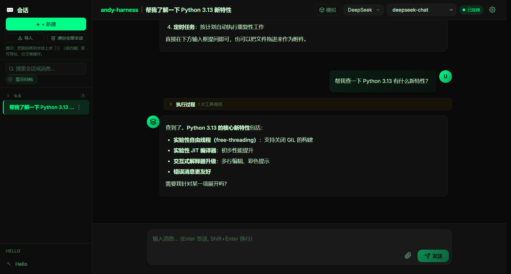
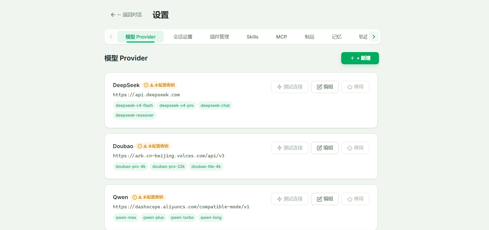
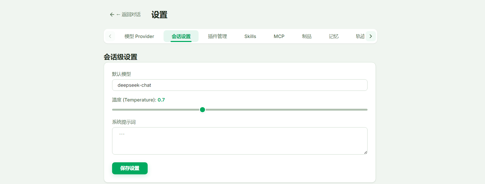
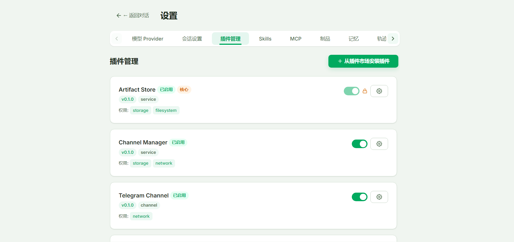
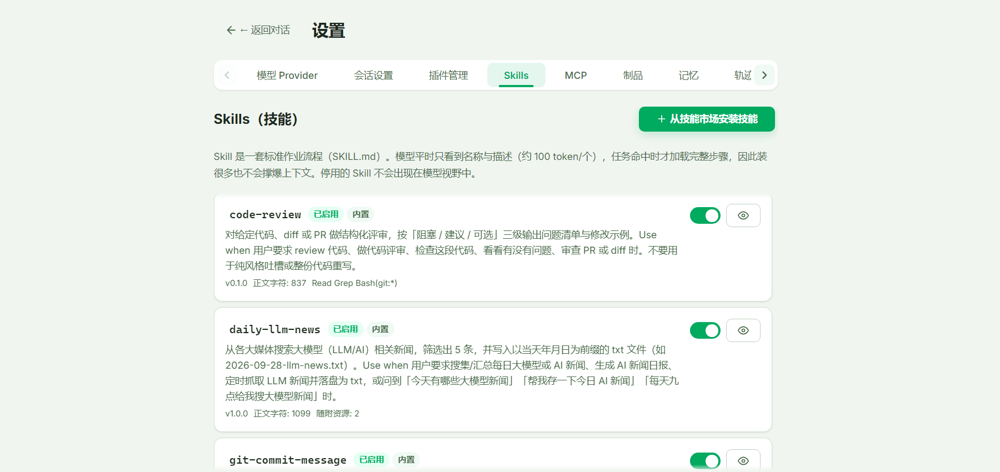
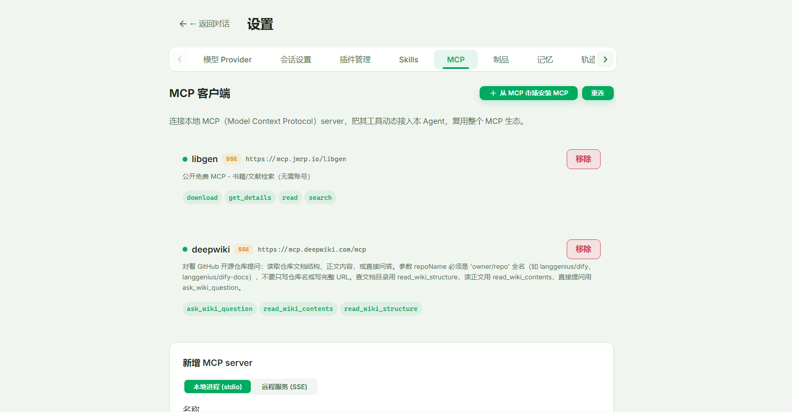
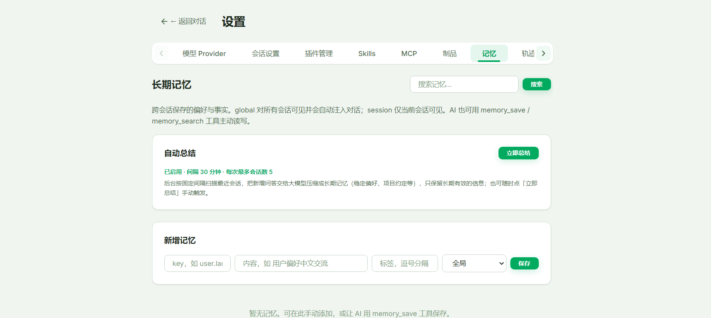
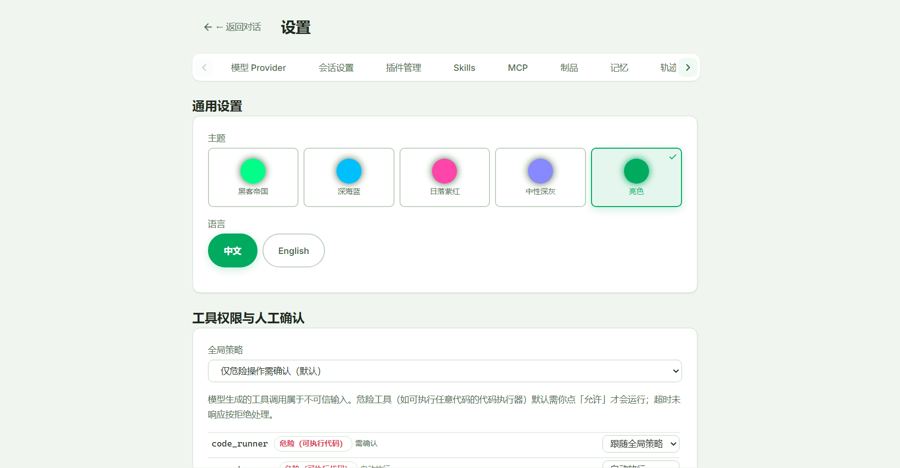
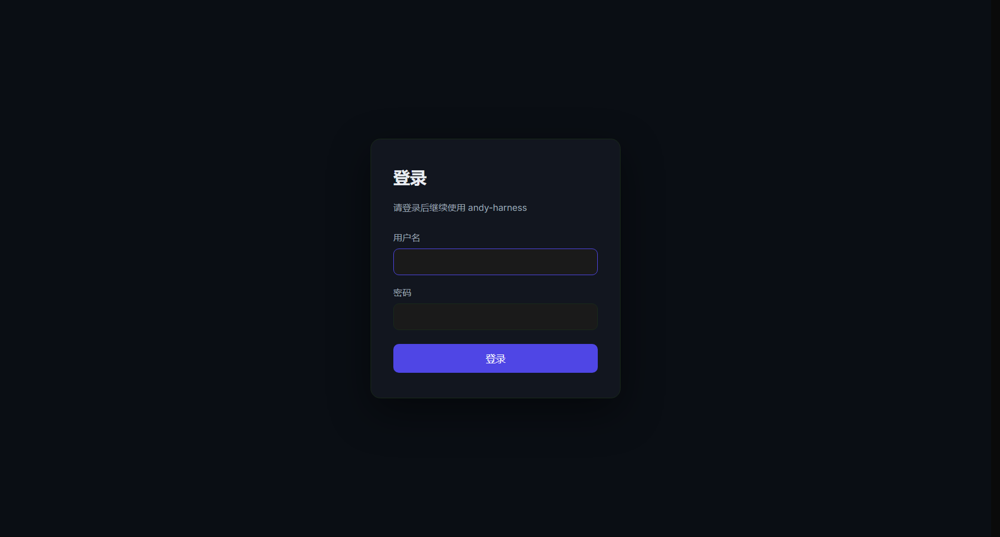

# andy-harness v1.0.0 用户使用手册

> 版本：**v1.0.0（开发者预览版）**　|　编写日期：2026-09-30
> 适用对象：希望在**本机**搭建一个插件化 AI Agent 底座的开发者
> 手册中所有截图均取自 v1.0.0 实际运行界面（1440×900 视口，Windows 10）。

---

## 目录

1. [项目简介与适用场景](#1-项目简介与适用场景)
2. [环境要求与安装启动](#2-环境要求与安装启动)
3. [界面总览：首页与对话页](#3-界面总览首页与对话页)
4. [第一次对话（从零到出结果）](#4-第一次对话从零到出结果)
5. [会话管理（侧边栏）](#5-会话管理侧边栏)
6. [消息操作（复制 / 重答 / 追问 / 分叉 / 删除）](#6-消息操作复制--重答--追问--分叉--删除)
7. [设置页十大标签详解](#7-设置页十大标签详解)
8. [主题切换](#8-主题切换)
9. [认证与多用户](#9-认证与多用户)
10. [进阶能力（仅有 REST API，暂无界面入口）](#10-进阶能力仅有-rest-api暂无界面入口)
11. [常见问题排查](#11-常见问题排查)
12. [附录：环境变量与数据文件](#12-附录环境变量与数据文件)

---

## 1. 项目简介与适用场景

**andy-harness** 是一个**插件化 Agent Harness（智能体底座）**。它不是一个聊天机器人，而是一套把"让大模型稳定、安全、可观测地干活"工程化的框架：

- **插件化**：工具、技能、UI 扩展、接入渠道全部是插件，内核零业务逻辑；
- **可观测**：每次对话的模型调用与工具调用都落为 span 链（轨迹），能看到"哪里慢、哪里贵、哪里错"；
- **省 context**：工具超大输出自动落盘为「制品」，上下文只留摘要与引用；长期记忆按相关性注入；
- **可控**：工具按 只读 / 写操作 / 危险 分级，危险操作（如执行代码）默认弹窗要你点「允许」才运行；
- **可扩展**：内置插件市场 / 技能市场 / MCP 市场，一键装新能力；也支持从 zip / git 安装第三方包。

**典型用法**：本机私有部署的 AI 助手底座、Agent 工程学习样本、插件/技能二次开发平台。
**默认部署形态**：单用户、本机访问，数据全部落在本机文件里，不依赖任何云服务。

---

## 2. 环境要求与安装启动

### 2.1 环境要求

| 组件 | 版本要求 | 说明 |
|---|---|---|
| 操作系统 | Windows 10（已验证） | macOS / Linux **尚未验证**，存在未知风险 |
| Python | 3.11+ | 后端 FastAPI |
| Node.js | 18+（建议 20/22） | 前端构建 |
| 包管理器 | **pnpm**（必须） | 用 `npm install` 会导致依赖不一致 |
| 浏览器 | Chrome / Edge 现代版本 | 访问 `http://localhost:5173` |
| 大模型 API Key | DeepSeek / Qwen / Doubao / 任意 OpenAI 兼容服务 | 深度调试过的模型是 DeepSeek `deepseek-v4-flash` |

### 2.2 三步启动（开发模式）

```bash
# ① 后端：创建虚拟环境并安装依赖
cd backend
python -m venv .venv
.venv/Scripts/python.exe -m pip install -e .        # Windows
# macOS/Linux 请用 .venv/bin/python -m pip install -e .

# ② 前端：安装依赖
cd frontend
pnpm install

# ③ 启动
# 方式 A：分别启动
cd backend  && .venv/Scripts/python.exe -m uvicorn harness.main:app --host 127.0.0.1 --port 8000
cd frontend && pnpm dev          # 默认 http://localhost:5173

# 方式 B（Windows 推荐）：仓库根目录一键启动
start-all.bat
```

> **访问地址必须用 `http://localhost:5173`**（前端 dev 绑定 IPv6，直连 `127.0.0.1` 可能不通）。
> 桌面壳（Tauri）用户直接双击安装包即可，无需上述步骤，详见 `desktop/README.md`。

### 2.3 首次打开


首页是极简的入口页：背景为「黑客帝国」数字雨动画，中部是项目名与两个按钮——

- **开始解决问题**：跳转到 `/chat`，直接开始聊天；
- **制定个性化**：跳转到 `/settings`，配置模型、插件、记忆等一切能力。

> 英文界面下这两个按钮分别为 **Start Solving** 与 **Personalize**。

---

## 3. 界面总览：首页与对话页

### 3.1 对话页（空态）


对话页分成三块：

| 区域 | 内容 |
|---|---|
| 左侧会话栏 | 新建 / 导入 / 清空、搜索框、按日期分组的会话列表 |
| 顶部标题栏 | 品牌名 + 当前会话标题；右侧是**模拟模式**开关、Provider 下拉、模型选择器、连接状态徽章、设置齿轮（启用认证时还有「退出登录」） |
| 右侧主区 | 消息区 + 底部输入框 |

**连接状态徽章**有四种：`已连接` / `连接中...` / `重连中...` / `已断开`，对应 WebSocket 状态。若长时间「已断开」，说明后端未启动或端口被占（见第 11 节）。

### 3.2 对话页（有内容）



这张图展示了实际对话中的关键元素：

1. **AI 回答的工具调用过程框**（标题「执行过程」）：工具名、参数、结果逐条展开——这是「可观测性」的直接体现；
2. **Markdown 渲染**：代码块高亮、列表、加粗；流式输出实时渲染；
3. **每条回答下方的 token 用量**：`输入 X · 输出 Y · 合计 Z tokens`（含缓存命中/未命中）；
4. **底部输入框**：Enter 发送、Shift+Enter 换行；右侧 📎 添加附件、发送 / 停止生成按钮；内容超过 7 行时出现「放大输入框」；
5. **顶部模型选择**：可随时换 Provider 与模型。

> 输入框**只支持点击 📎 选择文件**，不支持拖拽上传。

---

## 4. 第一次对话（从零到出结果）

### 4.1 第 1 步：配置模型 Provider

点顶部齿轮进入设置页，默认落在「模型 Provider」标签：



操作：

1. 点 **+ 新增**，填写四项：
   - **名称**：自定义，如 `DeepSeek`
   - **Base URL**：如 `https://api.deepseek.com/v1`
   - **API Key**：密码框，填你申请的密钥
   - **模型列表**：逗号分隔，如 `deepseek-chat,deepseek-reasoner`
2. 点 **添加** 保存；
3. 回到列表点 **测试连接** → 显示 `✓ 连通` 或 `✗ 失败`；
4. 状态开关切到 **已启用**。

要点：
- 行内有 `🔑 已配置` / `⚠ 未配置密钥` 徽章；**未配置密钥时不能启用 / 测试 / 停用**；
- **编辑**时 API Key 留空表示「不修改」；
- **删除**只对自定义 Provider（`custom_` 前缀）可用，且已配置密钥且启用时置灰。

### 4.2 第 2 步：设置默认模型与温度

切到「会话设置」标签：



- **默认模型**：新会话使用的模型名；
- **温度 (Temperature)**：0–2 滑块，实时显示数值，越高越发散；
- **系统提示词**：多行文本，作为该会话的系统指令；
- 改完点 **保存设置**（提示「设置已保存」）。

### 4.3 第 3 步：发消息

回到对话页，在输入框输入内容，**Enter 发送**（Shift+Enter 换行）。流式生成时输入框禁用，点 **停止生成** 可中断。

**没有 API Key 也能体验**：点顶部 **模拟模式** 开关（按钮变为「模拟中」），此时不消耗任何 token、不需要密钥，系统会用模拟回复演示完整交互流程。

### 4.4 附带文件（文档 / 图片）

点输入框 📎（title：`添加附件（文档 / 图片）`）选择文件：

| 限制项 | 数值 |
|---|---|
| 单次总文件数 | ≤ 8 |
| 文档 | ≤ 5 个，单个 ≤ 200KB（txt/md/csv/json/py/js/ts 等 26 种） |
| 图片 | ≤ 4 个，单个 ≤ 1.5MB（png/jpg/gif/webp/bmp，自动缩放控 token） |

文档内联为文本、图片按 OpenAI 视觉规范以 base64 注入模型。选错类型会提示「包含不支持的文件类型，已忽略」。已选附件以 chip 展示，可点 × 移除。

### 4.5 危险工具的人工确认弹窗

当 AI 要执行危险工具（如代码执行）时，会弹出确认框：标题「**AI 请求执行工具**」，展示**工具 / 原因 / 参数(JSON)**，底部两个按钮：**拒绝** / **允许执行**。超时未响应按**拒绝**处理。

策略可在「通用设置 → 工具权限与人工确认」调整（见 7.10）。

---

## 5. 会话管理（侧边栏）

| 操作 | 入口 | 说明 |
|---|---|---|
| 新建 | `+ 新建` | 存在空会话时会自动跳转并提示 |
| 导入 | `导入` | 选 `.json` 文件；缺 `messages` 字段会提示「不是有效的会话导出文件」 |
| 清空全部 | `清空全部会话`（有会话时才显示） | 确认「确定删除所有会话？此操作不可撤销。」 |
| 搜索 | 搜索框「搜索会话或消息…」 | 300ms 防抖，按标题或消息内容检索，显示命中徽章与片段，Esc 清空 |
| 归档切换 | `显示归档` / `隐藏归档` | 默认搜不到归档会话 |
| 重命名 | 双击会话项，或 ⋮ / 右键菜单 | |
| 导出 | ⋮ / 右键 → `导出` | 下载 JSON（含消息与任务清单），提示「已导出为 JSON 文件」 |
| 复制为新会话（分叉） | ⋮ / 右键 → `复制为新会话` | 提示「已分叉出新会话」，可安全试错 |
| 归档 / 删除 | ⋮ / 右键 | 删除需二次确认 |
| 分组 | 今天 / 昨天 / YYYY年M月D日 | 分组头可折叠 |

---

## 6. 消息操作（复制 / 重答 / 追问 / 分叉 / 删除）

把鼠标**悬浮**到消息上即可看到操作按钮：

**用户消息**
- **复制提问**：复制后提示「复制成功」3 秒；
- **删除本轮问答**：物理删除该提问及其回答（不可撤销）。

**助手消息**（有正文时）
- **复制回答**；
- **重新回答**：原位删除该轮并用原问题重新生成；
- **针对该回答继续追问**：进入追问模式，输入框上方出现引用条（显示「追问中」+ 原问题摘要，可「取消追问」）；
- **从此处分叉出新会话**：把该消息之前的历史复制为新会话。

每条助手回答下方还显示 **本次用量**（输入 / 缓存 / 未命中 / 输出 / 合计 tokens）。

---

## 7. 设置页十大标签详解

设置页顶部是一排标签，左右两侧有滚动箭头（标签多于一屏时）：`模型 Provider` / `会话设置` / `插件管理` / `Skills` / `MCP` / `制品` / `记忆` / `轨迹` / `定时任务` / `通用设置`。左上角有「← 返回对话」。

### 7.1 模型 Provider


新增 / 编辑 / 测试连接 / 启用·停用 / 删除，详见 [4.1](#41-第-1-步配置模型-provider)。

### 7.2 会话设置


默认模型 / 温度 / 系统提示词，详见 [4.2](#42-第-2-步设置默认模型与温度)。

### 7.3 插件管理



- **已装插件列表**：每行有 **启用/停用开关**（核心插件 `core` 锁定不可关，显示「核心」徽章）、**配置**（齿轮，按 schema 渲染表单，点「保存配置」）、**卸载**（仅市场来源插件，确认「此操作将删除插件文件，不可撤销。」）、权限标签与版本徽章；
- **从插件市场安装插件**：展开「插件市场」面板 → 每张卡片点 **说明** 看详情弹窗 → 点 **安装**（确认「确定从插件市场安装『名称』吗？」）→ 装好后卡片显示「已安装」徽章。

### 7.4 Skills（技能）



- 每行可 **启用/停用**（停用后不再进入模型视野），带来源徽章（内置 / 用户级 / 插件自带）、版本、正文字符数、资源数、`allowed_tools`；
- **查看详情**（眼睛图标）：弹出 SKILL.md 正文与随附资源列表——这就是"三级渐进式披露"：目录常驻、命中才加载正文；
- **重新扫描**：重新扫描技能目录。

### 7.5 MCP（接入外部工具生态）



- **添加并连接**：
  - **本地进程 (stdio)**：名称、启动命令、参数（空格分隔）；
  - **远程服务 (SSE)**：名称、服务地址（SSE）、请求头（每行 `Key: Value`，可选）、描述（可选）；
- 列表项显示连接状态点（绿=已连 / 灰=未连）、类型徽章、命令或 URL、**工具 chips**（该 server 提供了哪些工具）；
- **重连** / **移除**（确认「确定移除该 MCP server (名称)」）。

> 客户端同时兼容**旧版 SSE**（GET 建流）与 **streamable-http**（POST 直连），远端只支持其中一种时会自动适配。

### 7.6 制品（大输出自动落盘）


- 工具返回超大结果时自动落盘为「制品」，上下文只保留摘要与引用，避免撑爆 token 预算；模型可用 `read_artifact` 分页回读全文；
- 列表显示工具名、id、字数/字节、时间、摘要；
- **查看**：就地展开全文预览（不是下载）；**删除**：二次确认；
- 若插件未激活，会提示「制品服务未启用（artifact_store 插件未激活）」。

### 7.7 记忆（长期记忆）



- **搜索**：输入关键词按「搜索记忆…」+ `搜索` 按钮（Enter 也可触发）；底层是余弦语义检索（默认零依赖离线 HashingEmbedder，配 `HARNESS_EMBEDDING_MODEL` 后走 OpenAI 兼容 `/embeddings`），无命中自动回退子串匹配；
- **自动总结卡片**：显示「已启用/已关闭 · 间隔 · 每次最多会话数」，可点 **立即总结**（按钮变「总结中…」，完成后提示「总结完成」）；
- **新增记忆**：key（如 `user.language`）、内容、标签（逗号分隔）、作用域（全局 / 会话）→ `保存`；
- 列表每行可 **编辑**（改内容与标签 → 保存/取消）与 **删除**（二次确认）。

### 7.8 轨迹（运行轨迹 Tracing）


- 每次对话的 span 链（模型调用 + 工具调用的耗时、token、输入输出摘要）落在这里；
- 每个 trace 显示 span 数、步骤、token 用量、错误数；点 **展开** 查看**泳道图**与逐条 span 明细（in/out 摘要、token、错误）；
- **刷新** / **删除**（二次确认）。

### 7.9 定时任务


点 **新建任务**（或列表项 **编辑**）打开表单：

- **任务名称**、**任务说明**（可选）
- **调度策略**（四选一）：
  - `每天固定时间` → 选时间
  - `每周` → 选星期 chips（一~日，可多选）+ 时间
  - `固定间隔` → 每隔 [数字] + 分钟/小时
  - `一次性` → 执行时间（日期时间）
- **任务内容**：交给 AI 的指令（多行）
- **工具开放范围**（关键安全设计）：`可用的 MCP 数据源` / `可用的 Skills` / `其他可用工具` 三组多选 chips——**未勾选的一律不开放**，危险工具标红
- **模型服务** 与 **模型** 下拉（可 `自动（优先 DeepSeek）`）
- **运行上限**：最大工具迭代次数、超时（秒）
- **创建后立即启用** 复选项

任务列表每项：停用 / 启用 开关、**立即执行**、编辑、**运行历史**（展开看每次运行摘要/错误，触发来源标注 手动/定时）、删除；并显示「下次运行」时间与上次状态（成功/失败/已跳过/运行中）。

> 每个任务在**新建的隔离会话**中运行，任务工具集只含勾选的那些，避免越权。

### 7.10 通用设置（主题 / 语言 / 权限）



- **主题**：5 张卡片，点击即切换（选中打勾）——黑客帝国 / 深海蓝 / 日落紫红 / 中性深灰 / 亮色；
- **语言**：中文 / English；
- **工具权限与人工确认**：
  - **全局策略**下拉：`全部自动放行` / `仅危险操作需确认`（默认）/ `写操作与危险操作需确认` / `所有工具都需确认`；
  - 下方每个已注册工具一行：风险徽章（只读 / 写操作 / 危险（可执行代码））+ 覆盖下拉（跟随全局策略 / 自动放行 / 需确认 / 拒绝执行）；
  - 危险工具默认需你点「允许」才运行，超时按拒绝处理。

---

## 8. 主题切换

在「通用设置 → 主题」点任意一张卡片即可立即换肤，选择会持久化（同时写本地与后端 `/api/settings`），刷新后保持。

**黑客帝国（Matrix）** 主题下的对话页与首页：


---

## 9. 认证与多用户

**默认关闭**：不加任何环境变量时是本机单用户模式，行为零变化，不需要登录。

**开启方式**：

```bash
# 后端启动时加环境变量
HARNESS_AUTH=1 .venv/Scripts/python.exe -m uvicorn harness.main:app --host 127.0.0.1 --port 8000
```

启动后：
- `/api/**` 强制 Bearer token（PBKDF2 口令哈希 + HMAC 签名，默认有效期 12h）；
- 会话与长期记忆按 `user_id` 隔离；WebSocket 支持 `?token=` 握手，无效则关闭（1008）；
- 前端**自动出现登录页**，任意页面未认证都会被锁定到登录门；401 或 WS 1008 时自动回到登录页。
- **状态变更类端点需管理员身份**：插件 / 技能 / MCP 的安装卸载、权限模式与系统设置写入等写操作，服务端统一经 `require_admin` 校验管理员身份，普通用户仅可调只读接口；单用户默认关闭认证时不受此限制（行为零变化）。

登录页如下：



**初始管理员**：开启认证但没预设密码时，后端会在启动日志里生成初始管理员账号与随机口令，形如：

```
已启用认证但未提供管理员密码，已生成初始管理员 'admin' / xxxxxxxx（请立即登录并修改），也可用 HARNESS_AUTH_ADMIN_PASSWORD 预设
```

建议用 `HARNESS_AUTH_ADMIN_PASSWORD=<你的强口令>` 预设，首次登录后立即修改。
登录成功后，对话页右上角出现 **退出登录** 按钮。

> **当前限制**：多用户目前只提供「登录门」。用户 / 权限的**创建与管理暂无界面入口**，需调用 REST API（`GET/POST /api/users`、`DELETE /api/users/{id}`，需管理员身份）。

---

## 10. 进阶能力（仅有 REST API，暂无界面入口）

以下几项能力后端已实现，但 v1.0.0 **没有提供界面**，需要通过 REST API 使用：

| 能力 | 入口 | 备注 |
|---|---|---|
| 多渠道接入（Webhook / Telegram） | REST 创建与管理 | 设置页**无**渠道状态入口（README 旧描述有误，已订正） |
| Computer Use 桌面操控 | 后端插件启用后模型按需调用 | **无**前端开关（README 旧描述有误，已订正） |
| Jev 结构化决策 | 仅插件 Key 配置入口 | 决策由模型自动触发，无独立调用界面 |
| Checkpoint 断点续跑 | `POST /api/runs/{run_id}/resume` | 无界面按钮 |
| 用户 / 权限管理 | `GET/POST /api/users`、`DELETE /api/users/{id}` | 无界面 |

示例（断点续跑）：

```bash
curl -X POST http://127.0.0.1:8000/api/runs/<run_id>/resume
```

---

## 11. 常见问题排查

| 现象 | 原因与处理 |
|---|---|
| 前端打不开 | 必须用 `http://localhost:5173`，不要用 `127.0.0.1` |
| 没装依赖就启动，报「系统找不到指定的路径」/ 缺模块 | 先执行第 2.2 节的 ①②两步 |
| `make install` 报 command not found（Windows） | Windows 无 make，按 2.2 手动执行 |
| 提示必须用 pnpm | 不要 `npm install` |
| 能启动但没法对话 | 说明 Provider 未配 API Key，先做 [4.1](#41-第-1-步配置模型-provider) |
| 端口被占用（8000 / 5173） | 换端口或结束占用进程；桌面壳与 `start-all.bat` 不要同时跑 |
| 连接状态一直「已断开」 | 后端未启动 / 端口不对，检查 8000 是否在监听 |
| 制品 / 记忆页提示「服务未启用」 | 对应插件（`artifact_store` / `memory_manager`）未激活，去「插件管理」启用 |
| 开启认证后历史图片全部裂图 | v1.0.0 已修复：图片改用 fetch + blob 渲染（可带 Bearer），若仍异常请确认已重启后端与前端 |
| Computer Use 提示「桌面不可用」 | 未装 `desktop` extra：`uv sync --extra desktop` |
| 桌面壳报缺 `cargo` / Rust 工具链 | 见 `desktop/README.md` 或改用 Web 模式 |

---

## 12. 附录：环境变量与数据文件

### 12.1 环境变量全表

> 下表按「后端实际读取的代码路径」整理（2026-10-01 复核）。带 `HARNESS_` 前缀的是本项目自己的变量；`DEEPSEEK_API_KEY` / `JEV_API_KEY` / `OPENAI_API_KEY` / `MCP_CONFIG_PATH` 是回退用的标准变量。**未列出的变量不会被读取**，请以本表为准。

**① 运行与存储**

| 变量 | 作用 | 默认 |
|---|---|---|
| `HARNESS_DB_PATH` | SQLite 数据库路径 | `backend/data/harness.db` |
| `HARNESS_ATTACHMENTS_DIR` | 附件落盘根目录（按会话分子目录） | `backend/data/attachments` |
| `HARNESS_ARTIFACTS_DIR` | 制品落盘目录 | `backend/workspace/artifacts` |
| `HARNESS_ARTIFACTS_MAX` | 制品数量上限 | 500 |
| `HARNESS_OFFLOAD_THRESHOLD` | 工具输出落盘阈值（字符） | 6000 |
| `HARNESS_SPANS_MAX` | 轨迹 span 条数上限 | 20000 |
| `HARNESS_ALLOWED_ORIGINS` | 追加允许的 CORS 来源（逗号分隔），用于自定义前端端口 | 空（仅内置来源） |
| `HARNESS_SANDBOX_BACKEND` | 代码执行沙箱后端：`local` / `docker` | `local` |
| `MCP_CONFIG_PATH` | MCP 配置文件路径（`;` 分隔多个） | `backend/mcp.json` |

**② 认证与多用户（`HARNESS_AUTH=1` 才生效）**

| 变量 | 作用 | 默认 |
|---|---|---|
| `HARNESS_AUTH` | 置 `1` / `true` / `yes` / `on` 开启认证与多用户 | 关闭（单用户模式） |
| `HARNESS_AUTH_ADMIN_USERNAME` | 初始管理员用户名 | `admin` |
| `HARNESS_AUTH_ADMIN_PASSWORD` | 初始管理员口令 | 未设则随机生成并打印到日志 |
| `HARNESS_AUTH_SECRET` | token 签名密钥 | 未设则持久化到 `data/auth_secret.txt`（重启后已签发 token 仍有效） |
| `HARNESS_AUTH_TOKEN_EXPIRE_MINUTES` | 访问令牌有效期（分钟） | 720（12 小时） |
| `HARNESS_CHANNEL_USERNAME` | 渠道入站消息归属哪个用户 | 首位管理员 |

**③ 定时任务与长期记忆**

| 变量 | 作用 | 默认 |
|---|---|---|
| `HARNESS_SCHEDULER` | 定时任务开关（`0` / `false` 关闭） | 开 |
| `HARNESS_SCHEDULER_TICK` | 调度检查间隔（秒，最小 5） | 30 |
| `HARNESS_MEMORY_SUMMARY` | 记忆自动总结开关 | 开 |
| `HARNESS_MEMORY_SUMMARY_INTERVAL` | 自动总结间隔（秒，最小 60） | 1800 |
| `HARNESS_MEMORY_SUMMARY_MAX_SESSIONS` | 每次最多处理会话数（最小 1） | 5 |
| `HARNESS_EMBEDDING` | 置 `off` / `false` / `0` 关闭向量检索（退回子串匹配） | 开启 |
| `HARNESS_EMBEDDING_MODEL` | 嵌入模型名（留空则用零依赖离线 HashingEmbedder） | 空 |
| `HARNESS_EMBEDDING_API_KEY` / `OPENAI_API_KEY` | 嵌入接口的 Key（前者优先） | 空 |
| `HARNESS_EMBEDDING_BASE_URL` | 嵌入接口基址（OpenAI 兼容 `/embeddings`） | `https://api.openai.com/v1` |

**④ 渠道接入（Webhook / Telegram）**

| 变量 | 作用 | 默认 |
|---|---|---|
| `HARNESS_CHANNELS` | 渠道管理器总开关 | 开 |
| `HARNESS_WEBHOOK_NAME` | Webhook 渠道名（对应 `POST /api/channels/inbound/{name}`） | `webhook` |
| `HARNESS_WEBHOOK_SECRET` | Webhook 调用密钥（经 `X-Channel-Secret` 或 `?secret=` 传入） | 空（不校验，**不建议公网裸露**） |
| `HARNESS_WEBHOOK_ALLOWED_USERS` | 允许的调用方 user_id（逗号分隔） | 空（不限制） |
| `HARNESS_TELEGRAM_BOT_TOKEN` | Telegram Bot Token | 空（未配置则渠道不启动） |
| `HARNESS_TELEGRAM_ALLOWED_USERS` | 允许的 Telegram 用户 ID（逗号分隔） | 空（不限制） |
| `HARNESS_TELEGRAM_POLL_INTERVAL` | Telegram 轮询间隔（秒） | 1 |

**⑤ Provider / Jev 的 Key 回退**

| 变量 | 作用 | 默认 |
|---|---|---|
| `DEEPSEEK_API_KEY` | 内置 DeepSeek 插件未在设置页配置 Key 时的回退 | 空 |
| `JEV_API_KEY` | Jev 结构化决策插件的 Key 回退 | 空 |

> Qwen / Doubao 内置插件**不支持**环境变量回退，请在「设置 → Providers」中填写。

**⑥ 桌面壳（`desktop/`）**

| 变量 | 作用 | 默认 |
|---|---|---|
| `HARNESS_PYTHON` | 后端解释器路径 | 仓库 `backend/.venv`（release 包从 PATH 找 `python`） |
| `HARNESS_PORT` | 固定后端端口（由 Rust 壳读取） | 动态分配 |

**⑦ 开发与测试**

| 变量 | 作用 | 默认 |
|---|---|---|
| `HARNESS_NO_NETWORK` | 沙箱子进程「软禁网」标记（由沙箱管理器自动注入，用于阻断常见联网写法） | 不设置 |
| `HARNESS_SHELL_CARGO_CHECK` | 置 `1` 时让桌面壳测试执行真实 `cargo check`（需本机有 Rust 工具链） | 未设则跳过 |

### 12.2 数据文件位置

以下为**浏览器模式**（`make backend` / `start-all.bat`）下的默认位置；`HARNESS_DB_PATH` 与 `HARNESS_ATTACHMENTS_DIR` 可改写，桌面壳模式会把这两项指向每用户目录。

| 文件 | 说明 |
|---|---|
| `backend/data/harness.db` | 主数据库（会话 / 消息 / 上下文快照 / span / 制品索引 / 记忆 / 定时任务 / 渠道映射 / 用户） |
| `backend/data/attachments/<session_id>/` | 用户上传的文档与图片（删除会话会连带清理） |
| `backend/workspace/artifacts/` | 制品落盘内容（大工具输出、trace 落盘文本） |
| `backend/data/permission.json` | 工具权限策略与单工具覆盖 |
| `backend/data/skill_state.json` | 技能启停状态 |
| `backend/data/memory_state.json` | 记忆自动总结游标（跟随数据库目录） |
| `backend/data/settings.json` | 系统设置（主题 / 语言 / 默认模型 / 默认预算） |
| `backend/data/auth_secret.txt` | 认证签名密钥（自动生成，权限 0600，**切勿提交到仓库**） |
| `backend/data/computer_use_workspace/` | Computer Use 桌面操控的工作区 |
| `backend/mcp.json` | MCP 服务器配置（示例见仓库根 `mcp.example.json`；可能含鉴权 header，不入库） |
| `%TEMP%/harness_workspaces/` | 代码执行沙箱的临时工作区（local 后端，系统临时目录） |

> **备份建议**：升级或迁移前备份 `backend/data/` 与 `backend/workspace/` 两个目录即可覆盖全部持久化状态。删除仓库里的 `backend/data/` 就等于清空所有会话、设置与权限策略。

### 12.3 快捷键与交互

| 操作 | 方式 |
|---|---|
| 发送消息 | Enter |
| 换行 | Shift+Enter |
| 重命名会话 | 双击会话项 |
| 会话操作菜单 | 点 `⋮` 或右键 |
| 清空搜索 | Esc |
| 回到底部 | 上滑后出现的「向下」按钮 |
| 放大输入框 | 内容超 7 行时出现的按钮 |

---

> 本手册基于 v1.0.0 实际界面编写。若发现与实际不符，请提 Issue 并附截图。
